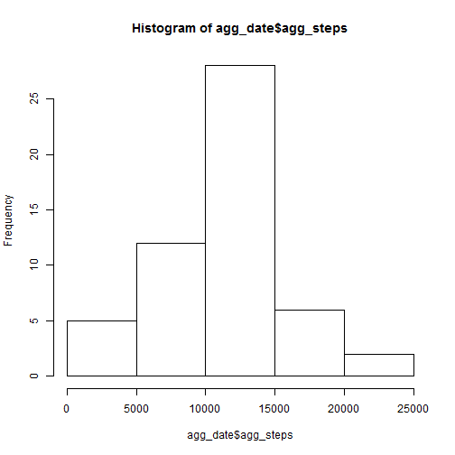
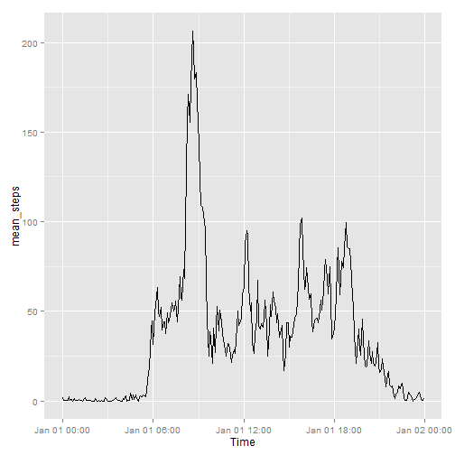
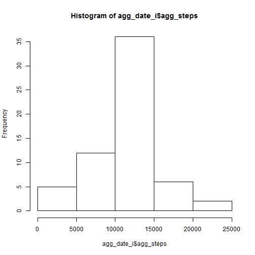

### Summary  

The data reviewed here consists of steps data captured at 5 minute intervals from a "fitbit" wearable device. This device tracks information and stores it for retrieval later. The data represents two months of step information logged daily at 5 minute intervals.  

### Data Load    

Let's load the data and convert the date and interval into a date time stamp.  


```r
tr <- read.csv("activity\\activity.csv", stringsAsFactors=FALSE)


tr$newdate <- as.POSIXlt(paste(tr$date,formatC(tr$interval, width = 4, format = 'd', flag=0))
                         ,format="%Y-%m-%d %H%M") 

str(tr)
```

```
## 'data.frame':	17568 obs. of  4 variables:
##  $ steps   : int  NA NA NA NA NA NA NA NA NA NA ...
##  $ date    : chr  "2012-10-01" "2012-10-01" "2012-10-01" "2012-10-01" ...
##  $ interval: int  0 5 10 15 20 25 30 35 40 45 ...
##  $ newdate : POSIXlt, format: "2012-10-01 00:00:00" "2012-10-01 00:05:00" ...
```

We now have 4 varaibles:  

1. steps - Number of steps taken...we can already see in the sample data from above that some values are missing
2. date - date of data capture
3. interval - the 5 minute interval in HH:MM format
4. newdate - the variable created from the date and interval variables for use later in analytics  

### What is mean total number of steps taken each day 

To determine this we will be removing the missing values from the data. I used the complete cases function but only allowed it to look at the steps column. We will also be summarizing the data by date.  


```r
tr_comp <- tr[complete.cases(tr[,1]),]


agg_date <- aggregate(x=list(agg_steps=tr_comp$steps), list(date=tr_comp$date), FUN="sum")

hist(agg_date$agg_steps)
```

 

```r
mean(agg_date$agg_steps)
```

```
## [1] 10766
```

```r
median(agg_date$agg_steps)
```

```
## [1] 10765
```

```r
sum(agg_date$agg_steps)
```

```
## [1] 570608
```

The histogram shows a slightly skewed distribution to the left but with most readings in the 15,000 and under steps per day.  

### Average daily activity pattern  

Here we will summarize across all days by time interval. We'll then convert the interval variable to a time value but set the day all to the same day. This lets us have a readable X axis


```r
mean_int <- aggregate(x=list(mean_steps=tr_comp$steps), list(interval=tr_comp$interval), FUN="mean") 

library(ggplot2)

mean_int$Time <- as.POSIXlt(paste("2014-01-01 ",
                                  formatC(mean_int$interval, width = 4, format = 'd', flag=0)),
                                          format="%Y-%m-%d %H%M")

ggplot(mean_int, aes(x=Time, y= mean_steps)) + geom_line() 
```

 

We can see the peak average steps taken is at the 08:35 interval at approximately 206 steps.  

### Imputing missing values  

Now let's look at the missing values in the data and come up with an approach to impute them from the data we have. Let's see how many missing values there are.  


```r
summary(tr)
```

```
##      steps           date              interval   
##  Min.   :  0.0   Length:17568       Min.   :   0  
##  1st Qu.:  0.0   Class :character   1st Qu.: 589  
##  Median :  0.0   Mode  :character   Median :1178  
##  Mean   : 37.4                      Mean   :1178  
##  3rd Qu.: 12.0                      3rd Qu.:1766  
##  Max.   :806.0                      Max.   :2355  
##  NA's   :2304                                     
##     newdate                   
##  Min.   :2012-10-01 00:00:00  
##  1st Qu.:2012-10-16 05:58:45  
##  Median :2012-10-31 11:57:30  
##  Mean   :2012-10-31 12:23:59  
##  3rd Qu.:2012-11-15 17:56:15  
##  Max.   :2012-11-30 23:55:00  
## 
```

There appear to be 2,304 missing values in the steps column. The method I'm going to use to replace them is to take the summary data by interval created for the analysis in the average daily activity pattern and use it to replace missing values in the data.  


```r
imp_ds <- merge(tr, mean_int[,1:2], by="interval")

imp_ds <- transform(imp_ds, new_steps = ifelse(is.na(steps), mean_steps, steps))

imp_ds <- subset(imp_ds, select=c(interval, new_steps, date, newdate)) 

utils::View(imp_ds)


agg_date_i <- aggregate(x=list(agg_steps=imp_ds$new_steps), list(date=imp_ds$date), FUN="sum")

hist(agg_date_i$agg_steps)
```

 

```r
mean(agg_date_i$agg_steps)
```

```
## [1] 10766
```

```r
median(agg_date_i$agg_steps)
```

```
## [1] 10766
```

```r
sum(agg_date_i$agg_steps)
```

```
## [1] 656738
```

It is interesting to see in the histogram that we now have more data in the under 15,000 step group. Since the data is distributed around this value taking the average to replace missings makes sense. I was surprised to see that the mean daily value before and after imputation was the same. After further examining the summary datasets by day for the two analyses I noticed that entire days of values were missing. Since I added 8 days of average values to the missing data having the average value stay roughly the same makes sense. The median value changes slightly because we added 8 more days of data back. The total steps for the group with imputed values does go up.  

### Is there a diference in patterns between weekdays and weekends?

Here we'll create a new factor variable to define weekends vs weekdays and then examine any differences between the groups.  


```r
imp_ds$DOW <- weekdays(imp_ds$newdate)

imp_ds <- transform(imp_ds, wknd=ifelse(imp_ds$DOW %in% "Saturday" | 
                                          imp_ds$DOW %in% "Sunday", "Weekend", "Weekday"))


imp_ds$wknd <- as.factor(imp_ds$wknd)

# Average steps taken across all days by time interval

mean_int_wknd <- aggregate(x=list(mean_steps=imp_ds$new_steps), 
                           list(interval=imp_ds$interval, wknd=imp_ds$wknd), FUN="mean") 

library(ggplot2)


mean_int_wknd$Time <- as.POSIXlt(paste("2014-01-01 ",
                                       formatC(mean_int_wknd$interval, width = 4, format = 'd', flag=0))
                                 ,format="%Y-%m-%d %H%M")

ggplot(mean_int_wknd, aes(x=Time, y= mean_steps)) + geom_line() + facet_grid(wknd ~ .)
```

 

Interestingly enough it appears that if we just examine the peak values the weekdays seem to have the greatest number fo steps. The overall graph shows that on weekends the users of these devices are more active than during the weekdays. I'd be further interested in seeing the occupations of the users. Perhaps fitbit users have more sedentary lifestyles during the working day.


